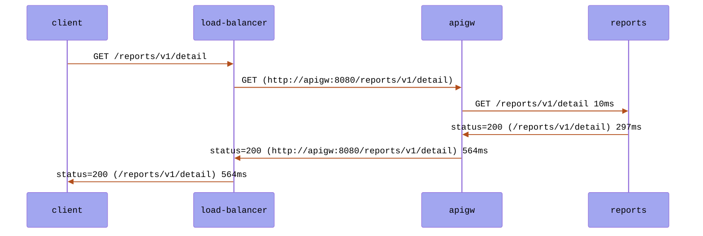

# Sequence Diagram
### **Service: reports**   (4 hits) 

**Correlator: c068f4f8-48af-4594-ad32-4f3ed331bc7c** 
---

Time in miliseconds is Delta from first timestamp 

```mermaid

sequenceDiagram
%%{init:
{'theme': 'default',
'themeCSS': 'g:nth-of-type(1) rect.rect { stroke:#004990; rx:3; ry:3; }; g:nth-of-type(2) rect.rect { stroke:#004990; rx:3; ry:3; };  g:nth-of-type(3) rect.rect { stroke:#004990; rx:3; ry:3; };',
'sequence':{ 'mirrorActors': true, 'actorFontSize': '13px'},
 'themeVariables': {'mainBkg': '#c9d7e4', 'actorBkg': '#a2A6F0', 'backgroundColor': '#f6f7fc', 'boxBorderColor': '#004990', 'signalColor': '#b34F1C', 'textColor': '#c245474', 'labelTextColor': '#C7C7C7', 'labelBoxBorderColor': '#7FBC00', 'labelBoxBkgColor': '#7FBC00', 'noteBkgColor': '#FFBA01', 'noteBorderColor': '#FFBA01', 'fontFamily': 'monospace', 'fontSize': 'large'}
}}%%
    participant client
    participant load-balancer
    participant apigw
    participant reports

    client ->> load-balancer: GET /reports/v1/detail
    load-balancer ->> apigw: GET  (http://apigw:8080/reports/v1/detail)
    apigw ->> reports: GET /reports/v1/detail 10ms
    reports ->> apigw: status=200 (/reports/v1/detail) 297ms
    apigw ->> load-balancer: status=200 (http://apigw:8080/reports/v1/detail) 564ms
    load-balancer ->> client: status=200 (/reports/v1/detail) 564ms
```